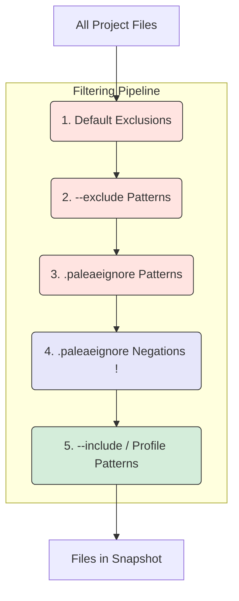

# Configuration

Paleae uses a powerful filtering system to give you precise control over your snapshots. This guide covers the `.paleaeignore` file, command-line profiles, and custom regex patterns.

## Table of Contents
- [Quick Reference](#quick-reference)
- [The .paleaeignore File](#the-paleaeignore-file)
- [Command-Line Profiles](#command-line-profiles)
- [Custom Regex Patterns](#custom-regex-patterns)
- [Filter Priority](#filter-priority)

---

## Quick Reference

| Method | How it Works | Best For |
| :--- | :--- | :--- |
| **Profiles** | Broad, predefined sets of rules (`minimal`, `ai_optimized`). | Quick, common use cases. |
| **`.paleaeignore`** | A file in your repo with `.gitignore`-style rules. | Project-specific, version-controlled ignore rules. |
| **`--include/--exclude`** | Command-line regex for one-off, specific filtering. | Dynamic or temporary filtering needs. |

---

## The .paleaeignore File

For project-specific rules that you want to save and version control, create a `.paleaeignore` file in your root directory. The syntax is the same as `.gitignore`.

### Basic Exclusions
Each line specifies a pattern to exclude.
```
# Comments are ignored
*.log
build/
dist/
*.tmp
```

### Negation (Force Include)
You can force-include a file that would otherwise be ignored by prefixing the pattern with `!`. This is useful for making exceptions to broad rules.

```
# Ignore all config files...
*.toml
*.json

# ...but always include these critical ones.
!pyproject.toml
!package.json
```

---

## Command-Line Profiles

Profiles are quick ways to apply a smart set of filtering rules, passed via the `--profile` flag in the [Usage Guide](Usage-Guide).

`--profile minimal` (Default)
- **What it does**: Includes most text files but excludes common patterns like `.git/`, `__pycache__/`, `node_modules/`, and build artifacts.
- **Use it for**: General-purpose snapshots, backups, or when you want a comprehensive view of the project.

`--profile ai_optimized`
- **What it does**: A stricter profile that focuses on core source code (`src/`, `tests/`) and essential project metadata (`pyproject.toml`, `README.md`).
- **Use it for**: Creating clean, focused snapshots specifically for analysis by an AI or LLM.

---

## Custom Regex Patterns

For maximum control, you can provide your own regex patterns on the command line. See the [Usage Guide](Usage-Guide) for command-line examples.

`--include <REGEX>`
- **Description**: Only include files whose paths match the regex. Can be used multiple times.
- **Example**: To snapshot only your `pyproject.toml` and files in the `src` directory:
  ```bash
  python3 paleae.py --include "^pyproject\.toml$" --include "^src/"
  ```

`--exclude <REGEX>`
- **Description**: Exclude any files whose paths match the regex.
- **Example**: To exclude all test files and any files in a `data` directory:
  ```bash
  python3 paleae.py --exclude "_test\.py$" --exclude "^data/"
  ```

---

## Filter Priority

Paleae applies filters in a specific, layered order. This diagram shows how files flow through the process, with each step filtering the set of files from the previous one.



1.  **Default Exclusions**: The built-in patterns (like `.git/`) are applied first to remove common noise.
2.  **`--exclude` Patterns**: Your custom command-line exclusions are applied next.
3.  **`.paleaeignore` Patterns**: All exclusion patterns from your `.paleaeignore` file are applied.
4.  **`.paleaeignore` Negations**: Any `!` patterns in your `.paleaeignore` file are applied, overriding any previous exclusions to bring files back into consideration.
5.  **`--include` / Profile Patterns**: Finally, if `--include` patterns are provided, only files that have survived the exclusion steps *and* match an include pattern are kept. If no `--include` patterns are given, the active profile's include rules are used instead.

---
*Paleae is a Python tool for creating clean codebase snapshots for LLM context, analysis, and reporting.*

