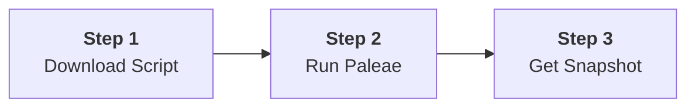

# Getting Started with Paleae

This guide covers the simple steps to download and run Paleae on your system. Because it's a single, dependency-free Python script, no installation is required.

## Visual Quickstart



---

## 1. Download the Script

You can download the `paleae.py` script using the command line tools below. To download it in your browser, **right-click this link and select "Save Link As..."**: [paleae.py](https://raw.githubusercontent.com/PaulTiffany/paleae/main/paleae.py)

### macOS / Linux
```bash
curl -fsSL https://raw.githubusercontent.com/PaulTiffany/paleae/main/paleae.py -o paleae.py
```

### Windows (PowerShell)
```powershell
Invoke-WebRequest -Uri https://raw.githubusercontent.com/PaulTiffany/paleae/main/paleae.py -OutFile paleae.py
```

## 2. Run Paleae

Navigate your terminal to the root directory of the project you want to snapshot, then execute the script.

```bash
# It's recommended to use python3 to ensure a modern version
python3 paleae.py
```

## 3. Check the Output

By default, Paleae will create a file named `repo_snapshot.json` in the directory where you ran the command. This single file contains the complete snapshot of all discovered text files in your project.

Congratulations, you've created your first snapshot!

---

## What's Next?

- **[Usage Guide](Usage-Guide)**: Learn about all the available command-line options.
- **[Configuration](Configuration)**: Discover how to use a `.paleaeignore` file to control which files are included.
- **[Advanced Usage](Advanced-Usage)**: See how to use profiles and other features for specialized workflows.

## Getting Help

- Run `python paleae.py --help` for command-line options.
- Check the [Troubleshooting](Troubleshooting) guide for common issues.

---
*Paleae is a Python tool for creating clean codebase snapshots for LLM context, analysis, and reporting.*

